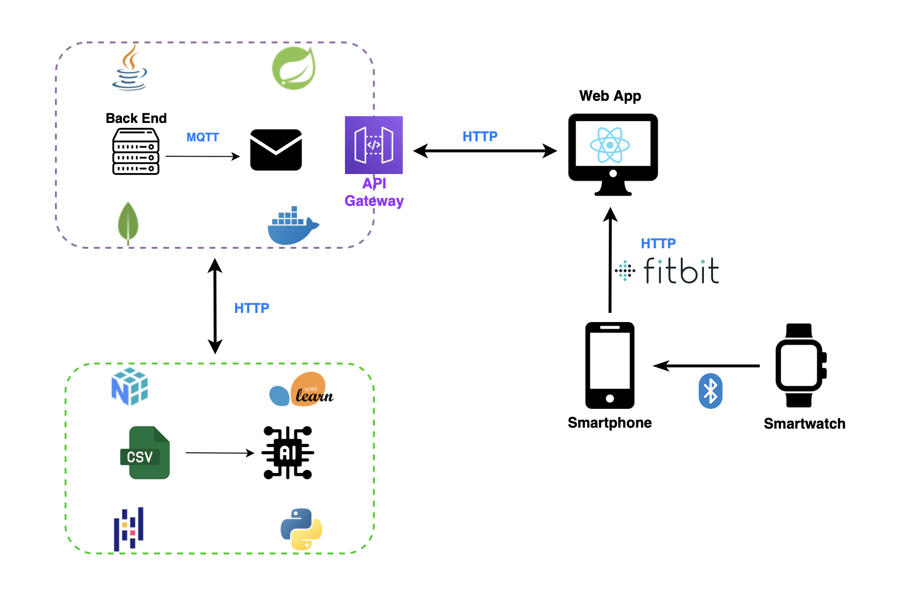

# wot-HealthCareProject-Franza-Schito-Backend

## Descrizione del progetto

Questo progetto si pone l’obiettivo di sviluppare una web app che possa offrire un supporto concreto nella gestione di queste patologie, mettendo a disposizione strumenti semplici ma efficaci per monitorare le abitudini quotidiane del paziente e rilevare eventuali cambiamenti significativi nel suo stile di vita. Il sistema si rivolge sia ai caregiver, che possono così avere un quadro più chiaro e aggiornato della situazione, sia ai medici, che possono accedere a dati utili per una valutazione clinica più approfondita.

Il progetto si è sviluppato su due fronti principali. Da una parte, è stato implementato un sistema di acquisizione dati basato su un sensore IoT, ovvero lo smatwatch Google Pixel, pensato per raccogliere in modo non invasivo informazioni rilevanti legate al comportamento e allo stato fisico del paziente. Dall’altra, è stata progettata una piattaforma accessibile via web, dotata di dashboard intuitive e personalizzate, in grado di restituire una visione sintetica ma dettagliata dell’andamento quotidiano.

## Architettura del sistema

  

Le componenti dell'architettura sono:
- **Front End - Javascript** 
- **Back End - Java** 
- **Machine Learning - Python** 
 
## Backend

Il cuore logico del sistema risiede nel backend, sviluppato utilizzando il framework  **Java Spring Boot**. Esso rappresenta oggi uno degli standard de facto nello sviluppo di applicazioni enterprise grazie alla sua architettura modulare e al forte ecosistema di librerie integrate.
Nel contesto dell’applicazione, Spring Boot gestisce l'intera logica di business: riceve i dati biometrici inviati dal dispositivo wearable tramite chiamate HTTP REST, li valida, li processa e li memorizza nel database. È responsabile anche dell’elaborazione periodica di questi dati per identificare eventuali anomalie cliniche, confrontando i valori rilevati con soglie parametriche definite per ciascun paziente.

## API REST

Il back-end del sistema, sviluppato in Java con il framework Spring Boot, espone una serie di API che consentono l'interazione con i dati raccolti, il modello predittivo e la gestione degli utenti. Le API sono organizzate per domini funzionali e sono progettate secondo i principi REST (Representational State Transfer), utilizzando convenzioni HTTP standard (GET, POST, PUT, DELETE) e risposte in formato JSON.

## Il repository del Front End si trova al seguente link: [wot-project-2023-2024-HealthCareProject-Franza-Schito-FrontEnd](https://github.com/UniSalento-IDALab-IoTCourse-2023-2024/wot-project-2023-2024-HealthCareProject-Franza-Schito-FrontEnd.git)

## Il repository del Machine Laerning si trova al seguente link: [wot-project-2023-2024-HealthCareProject-Franza-Schito-MachineLearning](https://github.com/UniSalento-IDALab-IoTCourse-2023-2024/wot-project-2023-2024-HealthCareProject-Franza-Schito-MachineLearning.git)

## Il sito web del progetto si trova al seguente link: [Sito Web](https://unisalento-idalab-iotcourse-2023-2024.github.io/wot-project-2023-2024-presentation-Franza-Schito-AndreaFr0.github.io/)
